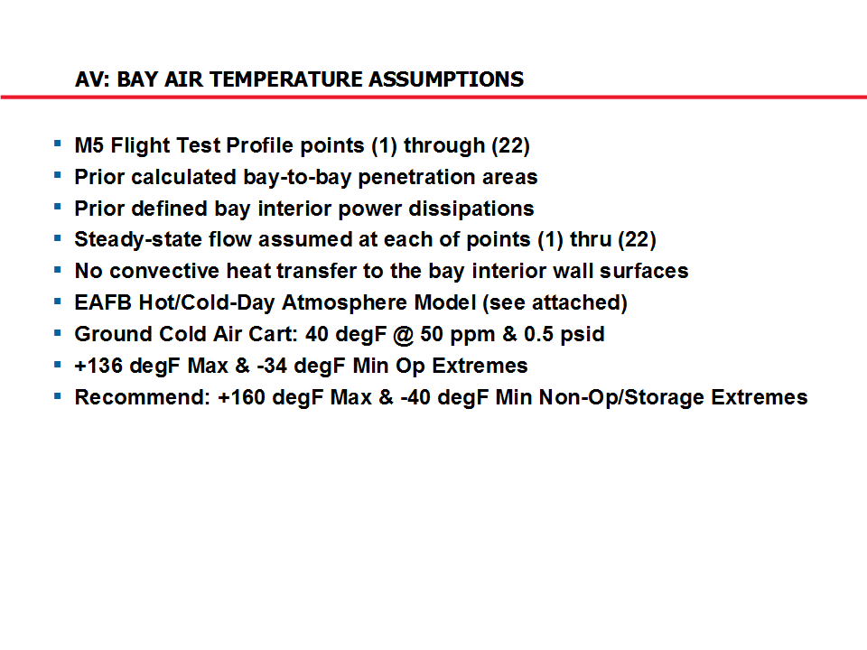
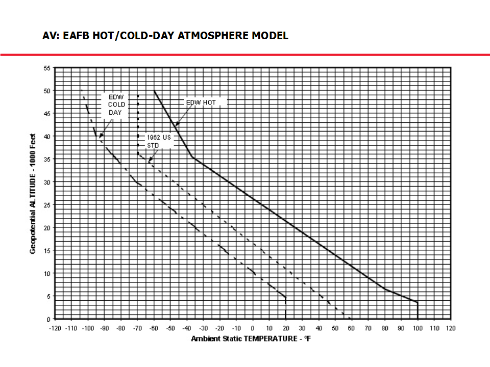

# ========================================
# Air Vehicle Venting/Internal Cooling System Thermal Analysis:
# ========================================

## I. Contents Overview:

## 
## 
## II. Overview of System Thermal Analysis Assumptions:

## 
## 
## III. Results Summary:

## 
## 
## IV. Overview of Thermal Analysis Planning Logic:

## 
## 
## V. Summary of Thermal Analysis Approach:

## 
## 
## VI. Overview of Interior Cooling Air Path:

## 
## 
## VII. Summary of Cooling Air Flow:

## 
## 
## VIII. Overview of Cooling Design Nomenclature:

## 
## 
## IX. Summary of AV Cooling Flow Requirements:

## 
## 
## X. Summary of Venting Analysis Results:

## 
## 
## XI. Overview of AV Inlet Design:

## 
## 
## XII. Summary of Interior Bay Penetration Sizing Assumptions:

## 
## 
## XIII. Penetration Sizing For Hot-Day/Low-Altitude Cruise Case:

## 
## 
## XIV. Penetration Sizing For Hot-Day/Low-Altitude Cruise Case (Cont.):

## 
## 
## XV. ECS Toolbox TOP Level Diagram:

## 
## 
## XVI. ECS Toolbox Bays & Penetrations Diagram:

## 
## 
## XVII. ECS Toolbox Bays Diagram:

## 
## 
## XVIII. ECS Toolbox Penetrations Diagram:

## 
## 
## XIX. ECS Toolbox Bay Penetration Sizing Diagram:

## 
## 
## XX. ECS Toolbox Bay Penetration Sizing: State & Error Variables Diagram:

## 
## 
## XXI. ECS Toolbox Bay Penetration Sizing Inputs Diagram:

## 
## 
## XXII. ECS Toolbox Bay Penetration Sizing Empirical Orifice Data:

## 
## 
## XXIII. AV Bay Air Temperature Analysis Assumptions:

## 
## 
## XXIV. Overview of Flight Envelope Test Points:

## 
## 
## XXV. Overview of Edwards AFB Hot/Cold-Day Atmosphere Model:

## 
## 
## XXVI. Summary of AV Bay Air Temperature Extremes:

## 
## 
## XXVII. Summary of AV Bay Air Temperature Results:

